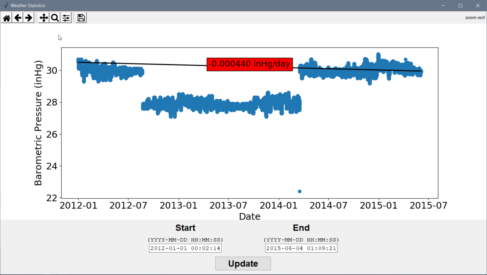

# Project 01: Weather Statistics

The aim of this project is to calculate statistics from a dataset. The program is designed to accept a beginning time and an ending time, inclusive of those data and return the coefficient of the slope of the barometric pressure.

## Demo

<p align='center'>
  
</p>

## Modules Used

- `re`: use regular expressions to parse date/time values
- `csv`: import tab-delimited data files
- `numpy`: store weather data in arrays
- `tkinter`: build the graphical user interface
- `pathlib`: deal with the path name problem between different operating system
- `datetime`: manipulate datetime objects
- `matplotlib`: plot weather data within Tkinter GUI

## Program Flow

<p align='center'>
  
</p>

### 01. Deal with File Paths Both On Windows, mac OS, and Linux

The first problem we confront in loading data is **the representation of file path under different operating systems**. Microsoft Windows uses a backslash character between folder names while another operating system like Linux uses a forward slash:

- Microsoft Windows: `C:\folder\file.txt`
- Unix/Linux: `/folder/file.txt`

In previous time, developers usually use the `os.path.join()` method of `os` module to solve this problem. There is a better solution to use `pathlib` standard library after Python 3.4 released.

```python
from pathlib import Path


file = Path(f'./data/Environmental_Data_Deep_Moor_2012.txt')
for row in DictReader(open(file, 'r'), delimiter='\t'):
    pass
```

Moreover, we can use `file.open('r')` instead of `open(file, 'r')` in the above code. Read [`pathlib` — Object-oriented filesystem paths](https://docs.python.org/3/library/pathlib.html#pathlib.Path.open) for more information.

### 02. Importing Data With the `csv` Module

We are going to use [`csv.DictReader()`](https://docs.python.org/3/library/csv.html#csv.DictReader). The method returns an object that iterates over lines in the given file and maps the information in each row to a `dict` (Changed in version 3.8, the previous version returns an `OrderedDict`).

Each dict (`row` in iteration) would be:

```python
{
    'date       time    ': '2014_01_01 00:02:57',
    'Air_Temp': '35.70',
    'Barometric_Press': '28.20',
    'Dew_Point': '32.80',
    'Relative_Humidity': '89.00',
    'Wind_Dir': '153.60',
    'Wind_Gust': '13.00',
    'Wind_Speed': ' 7.60'
}
```

Note that we only need the values of keys `date       time    ` and `Barometric_Press`. Since the time value are splited by `_`, ` ` or `:` in string, we use the regular expresstion to parse the string in `date       time    `:

```python
datetime_re = re.compile(r'[\d]{2,4}')  # pattern to match the 2 or 4 bit number in string
date2num(datetime(*list(map(int, datetime_re.findall(row['date       time    '])))))
```

### 03. Loading data into Numpy arrays

You may notice that we assigned the `np.array(datetime_list)` and `np.array(barpress_list)` to `self.datetime_array` and `self.barpress_array` instead of appending value to an `np.array()` in for loop directly. The concepts here are:

- We need them formatted as arrays to use with `matplotlib`.
- Python `list` is implemented as a variable-length array instead of a linked list so that Python `list` is designed to efficiently append items to them. Check [How are lists implemented in CPython?](https://docs.python.org/3/faq/design.html#how-are-lists-implemented-in-cpython) for more information.
- Numpy `array.append()` method will append values to a copy of that array. Python will need to create a complete copy of original array when we use this method in for loop or while loop, and that takes time and memory. Check [numpy.append](https://docs.scipy.org/doc/numpy/reference/generated/numpy.append.html) for more information.

### 04. Embedding `matplotlib` into `Tkinter`

Barron use the `TK().state('zoomed')` to maximize windows in Microsoft Windows operating system, but it's not supported in my Arch Linux. Take [tkinter python maximize window](https://stackoverflow.com/questions/15981000/tkinter-python-maximize-window) for references, the code should be:

```python
try:
    master.state('zoomed')
except (TclError):
    size = master.maxsize()
    master.geometry('{}x{}+0+0'.format(*size))
```

## Summary

Although the problem only ask us to calculate slope between given time range, it's a better idea to draw the graph for data visualization. We can observe the situations on the graph:

- In the beginning, it starts around an average of 30 inches of mercury, then drops to around 28 inches of mercury abruptly in August of 2012, and then returns to the original levels in March of 2014.

> There may be something wrong in the experiment of data collection.

## References

- [Python 3 Quick Tip: The easy way to deal with file paths on Windows, Mac and Linux](https://medium.com/@ageitgey/python-3-quick-tip-the-easy-way-to-deal-with-file-paths-on-windows-mac-and-linux-11a072b58d5f)
- [tkinter python maximize window](https://stackoverflow.com/questions/15981000/tkinter-python-maximize-window)
